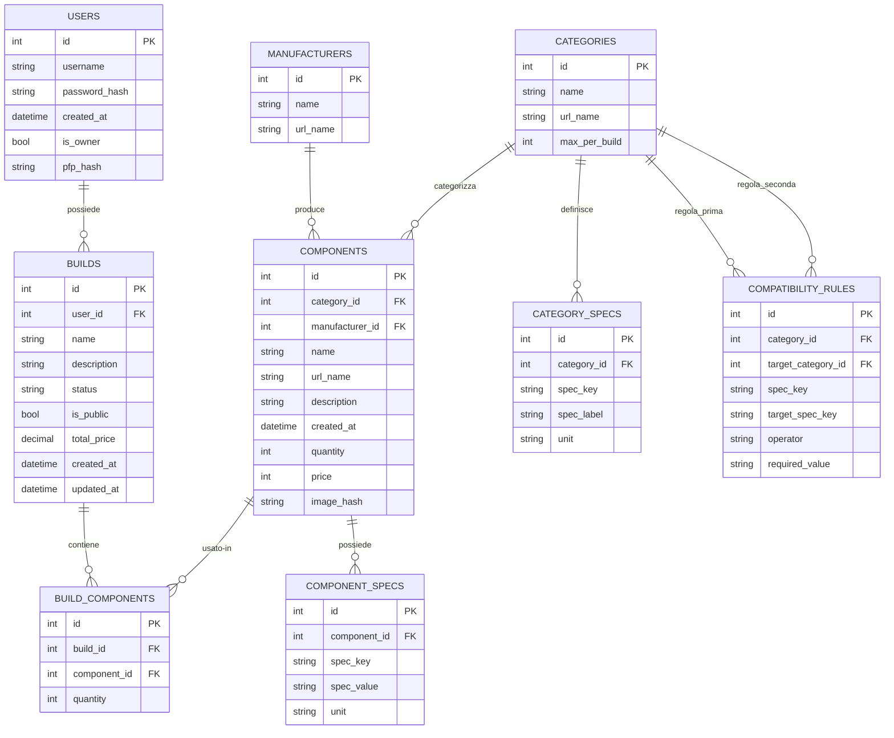
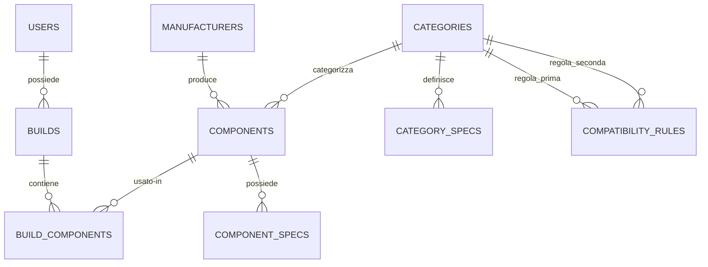

```mermaid
erDiagram

    USERS {
        int id PK
        string username
        string password_hash
        datetime created_at
        bool is_owner
        string pfp_hash
    }

    BUILDS {
        int id PK
        int user_id FK
        string name
        string description
        string status
        bool is_public
        decimal total_price
        datetime created_at
        datetime updated_at
    }

    BUILD_COMPONENTS {
        int id PK
        int build_id FK
        int component_id FK
        int quantity
    }

    COMPONENTS {
        int id PK
        int category_id FK
        int manufacturer_id FK
        string name
        string url_name
        string description
        datetime created_at
        int quantity
        int price
        string image_hash
    }

    CATEGORIES {
        int id PK
        string name
        string url_name
        int max_per_build
    }

    CATEGORY_SPECS {
        int id PK
        int category_id FK
        string spec_key
        string spec_label
        string unit
    }

    COMPONENT_SPECS {
        int id PK
        int component_id FK
        string spec_key
        string spec_value
        string unit
    }

    COMPATIBILITY_RULES {
        int id PK
        int category_id FK
        int target_category_id FK
        string spec_key
        string target_spec_key
        string operator
        string required_value
    }

    MANUFACTURERS {
        int id PK
        string name
        string url_name
    }

    USERS ||--o{ BUILDS : possiede
    BUILDS ||--o{ BUILD_COMPONENTS : contiene
    COMPONENTS ||--o{ BUILD_COMPONENTS : usato-in

    CATEGORIES ||--o{ COMPONENTS : categorizza
    MANUFACTURERS ||--o{ COMPONENTS : produce

    CATEGORIES ||--o{ CATEGORY_SPECS : definisce
    COMPONENTS ||--o{ COMPONENT_SPECS : possiede

    CATEGORIES ||--o{ COMPATIBILITY_RULES : regola_prima
    CATEGORIES ||--o{ COMPATIBILITY_RULES : regola_seconda
```

```mermaid
erDiagram

    USERS ||--o{ BUILDS : possiede
    BUILDS ||--o{ BUILD_COMPONENTS : contiene
    COMPONENTS ||--o{ BUILD_COMPONENTS : usato-in

    CATEGORIES ||--o{ COMPONENTS : categorizza
    MANUFACTURERS ||--o{ COMPONENTS : produce

    CATEGORIES ||--o{ CATEGORY_SPECS : definisce
    COMPONENTS ||--o{ COMPONENT_SPECS : possiede

    CATEGORIES ||--o{ COMPATIBILITY_RULES : regola_prima
    CATEGORIES ||--o{ COMPATIBILITY_RULES : regola_seconda
```